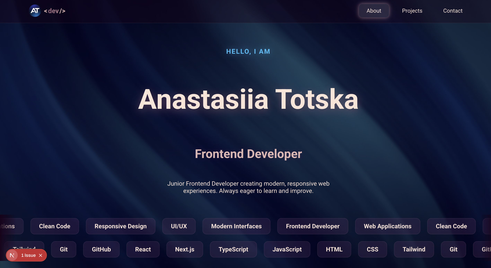
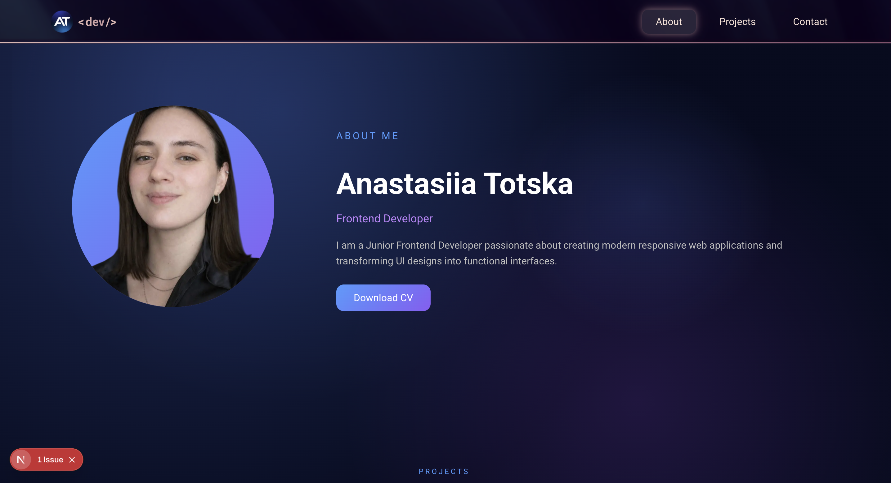
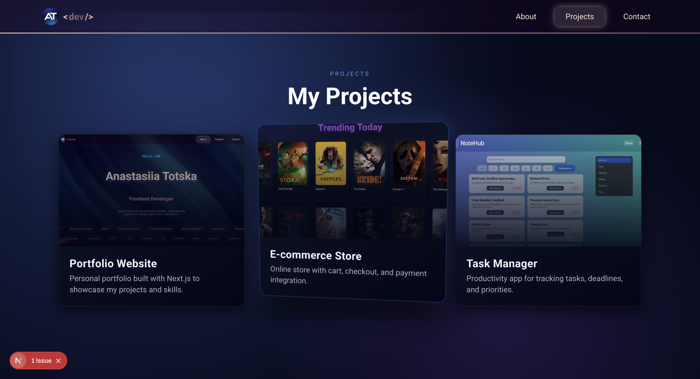

💼 Developer Portfolio

🌍 Live Demo
👉 https://anastasiia-totska-github-io.vercel.app/

A modern, responsive **developer portfolio website** to showcase projects, skills and contact information.

Built with **Next.js, TypeScript and Framer Motion** with smooth animations and interactive project previews.

📸 Screenshots

🏠 **Home Page**


👩 **About Section**


💻 **Projects Section**


✨ Highlights

✔ Modern responsive design
✔ Animated project cards
✔ Video preview on hover
✔ Interactive project modal
✔ Smooth animations with Framer Motion
✔ Clean component architecture
✔ Mobile-first layout
✔ Optimized performance with Next.js

🧩 Features

💼 Showcase personal projects
🎬 Hover preview videos inside project cards
📂 Detailed project modal with tech stack
🔗 Direct links to **Live Demo** and **GitHub**
📱 Fully responsive design for all devices
🎨 Modern UI with gradient and glass effects
⚡ Fast page load with optimized assets

#🧠 Project Card Interaction

Each project card includes a dynamic preview system:

Flow:

User hover → video preview starts
Mouse leave → video stops and resets
Click → project modal opens with details

This allows quick project exploration without leaving the page.

⚙️ Tech Stack

| Technology    | Purpose           |
| ------------- | ----------------- |
| Next.js       | React framework   |
| TypeScript    | Type safety       |
| Framer Motion | UI animations     |
| CSS Modules   | Component styling |
| React         | UI library        |

🎨 UI Philosophy

This portfolio focuses on modern UI principles:

• Clean minimal design
• Subtle animations
• Interactive project previews
• Clear project presentation
• Responsive layout
• Performance-first architecture

📁 Project Structure

```
src
 ├── app
 │   └── page.tsx
 │
 ├── components
 │   ├── ProjectCard
 │   ├── ProjectModal
 │   └── Contact
 │
 ├── sections
 │   ├── About
 │   ├── Projects
 │   └── Contact
 │
 ├── data
 │   └── projects.ts
 │
 ├── types
 │   └── projectType.ts
```

🚀 Getting Started

Clone the repository
git clone https://github.com/Anastasiia-git/anastasiia-totska.github.io.git
cd portfolio
Install dependencies
npm install
Run development server
npm run dev
Open in browser
http://localhost:3000

📦 Deployment

This project can be deployed easily with:

• **Vercel**
• Netlify
• Static export hosting

🛣 Roadmap

🧠 Add project filtering
🌙 Dark / Light theme switcher
📊 Project analytics
📝 Blog section
📬 Contact form with backend

👨‍💻 Author

**Anastasiia Totska**

GitHub → https://github.com/Anastasiia-git

📄 License

Educational project — free to use for learning purposes.
