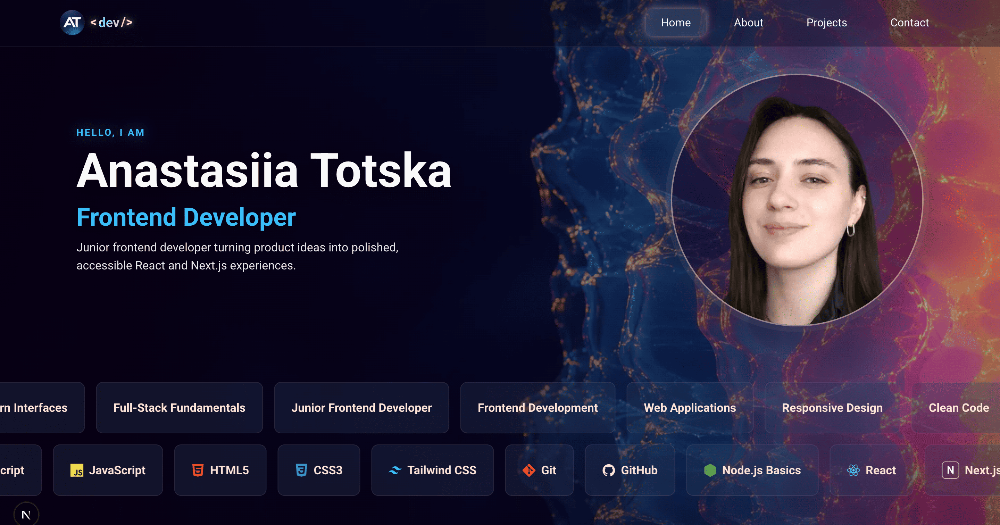
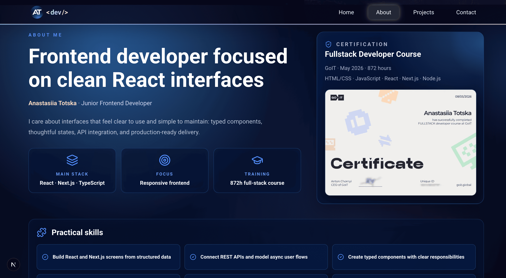
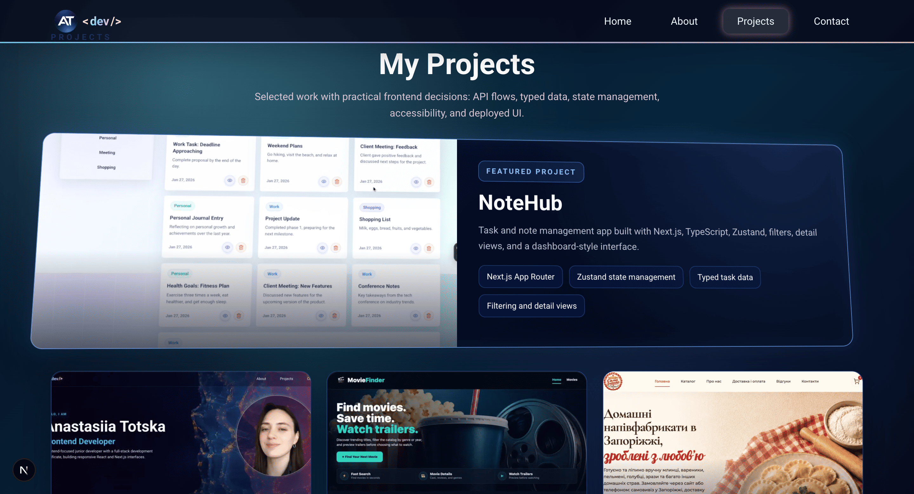

# Anastasiia Totska - Junior Frontend Developer Portfolio

Live demo: https://anastasiia-totska-github-io.vercel.app/

This is my personal frontend portfolio built with Next.js and TypeScript. It presents my junior frontend profile, selected projects, CV downloads, and contact links in one responsive page.

## What This Portfolio Shows

- I can build responsive React and Next.js interfaces.
- I can work with typed data, reusable components, and clean project structure.
- I can connect frontend work with real product needs: project previews, contact actions, CV links, and deployed demos.
- I can keep a project production-ready with TypeScript, ESLint, and Vercel deployment.

## Featured Project

### Task Manager

A task management app for creating, organizing, filtering, and reviewing notes with typed state management.

My role:
- Built the Next.js app structure and responsive task interface.
- Used TypeScript and Zustand for predictable client state.
- Added task cards, filters, detail views, and clean reusable UI.

Why it matters:
- Shows state management.
- Shows product thinking.
- Shows typed frontend architecture.
- Shows responsive UI implementation.

## Other Projects

### MovieFinder

A movie discovery app connected to the TMDB API.

Key work:
- Search and movie details.
- Cast and review data.
- Loading and error states.
- Responsive React UI.

### Portfolio Website

This portfolio itself is also a frontend project.

Key work:
- Next.js App Router setup.
- Reusable project cards and modal.
- SEO metadata.
- Downloadable English and German CVs.
- Responsive layout and accessible actions.

## Tech Stack

| Technology | Purpose |
| --- | --- |
| Next.js | React framework and App Router |
| TypeScript | Type safety |
| React | Component-based UI |
| CSS Modules | Component-level styles |
| Framer Motion | Simple UI animations |
| Vercel | Deployment |

## Quality Signals

- ESLint passes.
- Production build passes.
- Responsive layout.
- Accessible buttons and links.
- Project data is typed.
- `.next`, OS files, environment files, and logs are ignored.

## Screenshots

### Home



### About



### Projects



## Getting Started

```bash
npm install
npm run dev
```

Open http://localhost:3000 in your browser.

## Available Scripts

```bash
npm run dev
npm run build
npm run start
npm run lint
```

## Author

Anastasiia Totska

- GitHub: https://github.com/Anastasiia-git
- LinkedIn: https://www.linkedin.com/in/anastasiia-totska-53a76b3a8/
